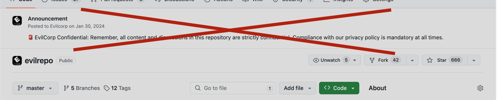

# F\*\*k that banner

  

Tired of that persistent and distracting notification banners on GitHub? Hide it with just a click!

## 🔧 Installation

- Clone or download the repository.
- Open Chrome and navigate to chrome://extensions/.
- Enable "Developer mode" at the top right.
- Click "Load unpacked" and select the directory where you've saved the extension.

## 🕹️ How to Use

After installation, simply click on the extension icon when you're on a GitHub page. A popup will appear with two options:

- Hide: Hide the notification banner wherever it appears on Github pages.
- Reset: Reset your preferences and bring the banner back.

  

